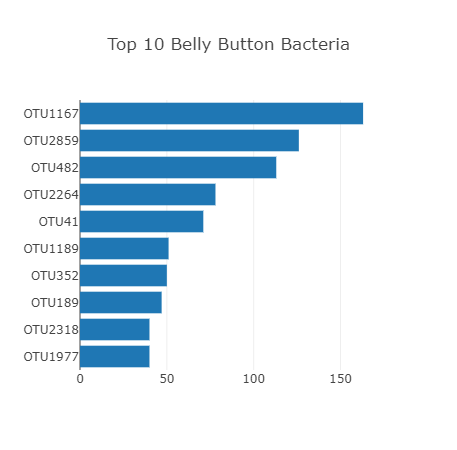
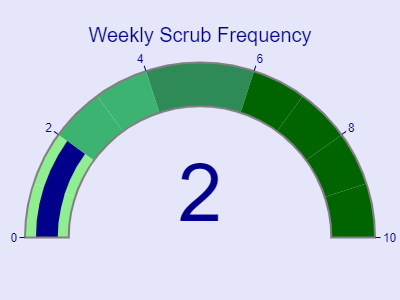
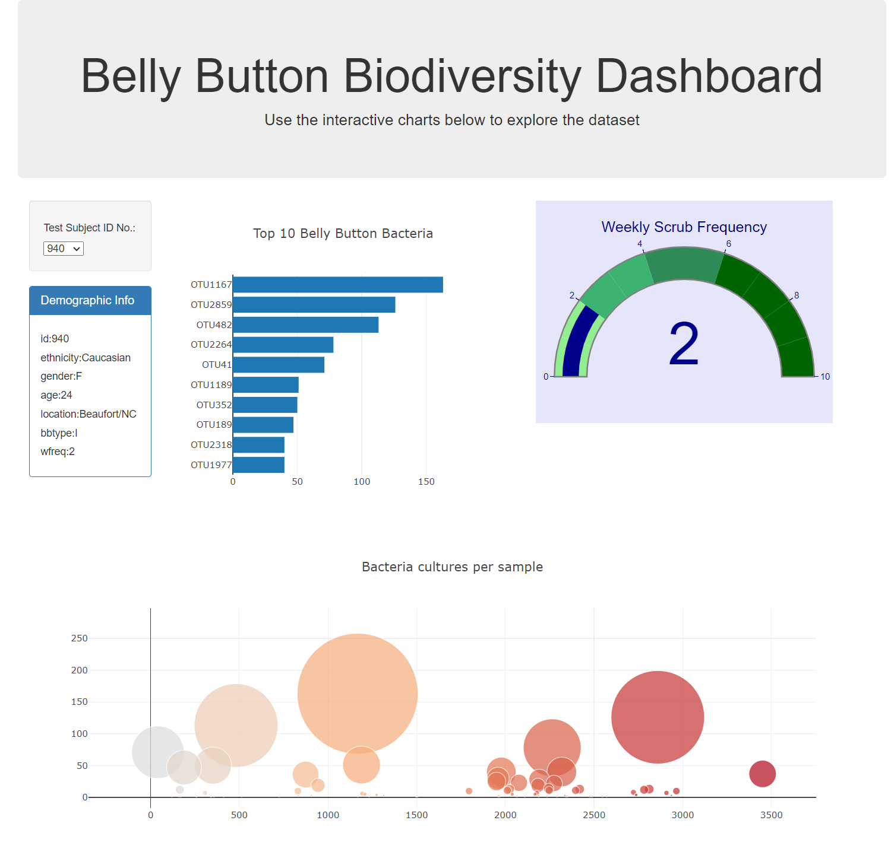

# belly-button-challenge
module 14 challenge

In this assignment an interactive dashboard has been build using Java Script, plotly library along with HTML and BOOtstrap to explore the Belly Button Biodiversity dataset https://robdunnlab.com/projects/belly-button-biodiversity/, which catalogs the microbes that colonize human navels.
The dataset reveals that a small handful of microbial species (also called operational taxonomic units, or OTUs, in the study) were present in more than 70% of people, while the rest were relatively rare.

Firstly, D3 library is used to read in samples.json from the URL https://2u-data-curriculum-team.s3.amazonaws.com/dataviz-classroom/v1.1/14-Interactive-Web-Visualizations/02-Homework/samples.json.
# Horizontal Bar Chart
The assignment asks us to Create a horizontal bar chart with a dropdown menu to display the top 10 OTUs found in that individual.

sample_values are used as the values for the bar chart.

otu_ids as the labels for the bar chart.

otu_labels as the hovertext for the chart.

# Bubble Chart
A bubble chart is created that displays each sample.

 otu_ids are used for the x values and for the marker colors.

 sample_values are used for the y values and also for the marker size.

 otu_labels used for the text values.

 # Gauge Chart (Optional)

 Gauge Chart  to plot the weekly washing frequency of the individual. The chart updates whenever a new sample is selected.

# Sample MetaData

sample metadata is displayed that shows an individual's demographic information. 

whenever an Id is selected from the dropdown menue , demographic info updates according to that chosen Id. All the graphs updates accorong to the chosen Id from the dropdown menue. A sample screenshot of the dashboard is attached.

Deployed website:

To run the app, click on the link below for the deployed page.

https://malihaspk.github.io/belly-button-challenge/

